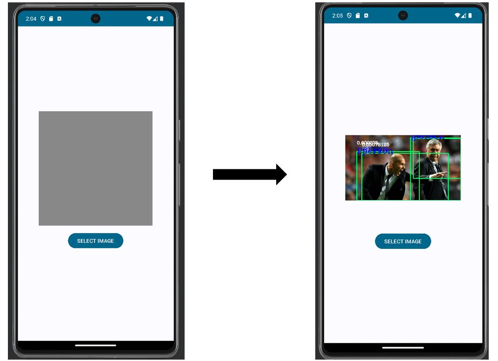

# object_detection_android_app
Androidの物体検出アプリ作成

## 概要
Android上で動く(サーバー経由なし)物体検出アプリの作成 
※ファイル数が多いため, [変更が必要なファイル](./src/)のみ追加

## 使用ライブラリ
* TensorFlow Light
* OpenCV for Android

## 完成図

## 解説資料
Android Studioでの環境構築からコードの書き方まで記載 
[解説資料](./解説資料.pdf)